# ERD – Plataforma Bloqer (esquema actual)

Documento generado por reverse engineering del schema Prisma actual. Sirve como referencia del modelo de datos antes de introducir cambios grandes en la plataforma.

**Origen:** `packages/database/prisma/schema.prisma`  
**Base de datos:** PostgreSQL con múltiples schemas.

---

## 1. Resumen ejecutivo

| Concepto | Valor |
|----------|--------|
| **Schemas PostgreSQL** | `public`, `finance`, `inventory`, `quality` |
| **Total de modelos/tablas** | **80** |
| **Enums** | `OrgRole`, `ProjectPhase`, `FieldType` (y otros implícitos vía String) |

### Distribución por schema

| Schema | Tablas | Dominio |
|--------|--------|---------|
| **public** | ~65 | Tenancy, proyectos, WBS, presupuesto, partidas, documentos, reportes, cronograma, daily reports, alertas, webhooks, notificaciones, plantillas |
| **finance** | 8 | Monedas, tipos de cambio, transacciones, líneas, pagos, cuentas bancarias, overhead |
| **inventory** | 6 | Categorías, ítems, ubicaciones, movimientos |
| **quality** | 5 | RFI, submittals, inspecciones |

---

## 2. Diagrama de alto nivel (grupos y relaciones clave)

```mermaid
erDiagram
  Organization ||--o{ OrgMember : "members"
  Organization ||--o{ Project : "projects"
  Organization ||--o{ Party : "parties"
  Organization ||--o{ Document : "documents"
  Organization ||--o{ FinanceTransaction : "finance"
  Organization ||--o{ Commitment : "commitments"
  Organization ||--o{ Certification : "certifications"
  Organization ||--o{ InventoryItem : "inventory"
  Organization ||--o{ Schedule : "schedules"
  Organization ||--o{ DailyReport : "daily_reports"
  Organization ||--o{ RFI : "rfis"
  Organization ||--o{ Submittal : "submittals"
  Organization ||--o{ Inspection : "inspections"
  Organization ||--|| OrgProfile : "profile"

  User ||--o{ OrgMember : "memberships"
  User ||--o{ Session : "sessions"
  User ||--o{ Notification : "notifications"

  Project ||--o{ WbsNode : "wbs_nodes"
  Project ||--o{ BudgetVersion : "budget_versions"
  Project ||--o{ ChangeOrder : "change_orders"
  Project ||--o{ Schedule : "schedules"
  Project ||--o{ DailyReport : "daily_reports"
  Project ||--o{ Document : "documents"
  Project ||--o{ RFI : "rfis"
  Project ||--o{ Submittal : "submittals"
  Project ||--o{ Inspection : "inspections"
  Project ||--o{ ProjectMember : "members"
  Project ||--o{ Alert : "alerts"

  WbsNode ||--o{ BudgetLine : "budget_lines"
  WbsNode ||--o{ ScheduleTask : "schedule_tasks"
  WbsNode ||--o{ ChangeOrderLine : "change_order_lines"
  WbsNode ||--o{ FinanceLine : "finance_lines"
  WbsNode ||--o{ CommitmentLine : "commitment_lines"
  WbsNode ||--o{ CertificationLine : "certification_lines"

  BudgetVersion ||--o{ BudgetLine : "budget_lines"
  BudgetVersion ||--o{ ChangeOrder : "change_orders"
  BudgetVersion ||--o{ Certification : "certifications"

  BudgetLine ||--o{ BudgetResource : "resources"
  BudgetLine ||--o{ CertificationLine : "certification_lines"
  BudgetLine ||--o{ BudgetLineActualCost : "actual_costs"

  Party ||--o{ PartyContact : "contacts"
  Party ||--o{ Commitment : "commitments"
  Party ||--o{ FinanceTransaction : "finance_transactions"
  Party ||--o{ Resource : "supplied_resources"
  Party ||--o{ ChangeOrder : "change_orders"

  GlobalParty ||--o{ GlobalPartyContact : "contacts"
  GlobalParty ||--o{ OrgPartyLink : "org_links"
  GlobalParty ||--o{ GlobalProduct : "products"
  GlobalParty ||--o{ DailyReportSupplier : "daily_report_suppliers"

  FinanceTransaction ||--o{ FinanceLine : "lines"
  FinanceTransaction ||--o{ Payment : "payments"
  FinanceTransaction ||--o{ OverheadAllocation : "overhead_allocations"
  FinanceTransaction ||--o{ InventoryMovement : "inventory_movements"

  Commitment ||--o{ CommitmentLine : "lines"
  Commitment ||--o{ FinanceTransaction : "finance_transactions"

  Certification ||--o{ CertificationLine : "lines"
  Certification ||--o{ FinanceTransaction : "finance_transactions"

  Document ||--o{ DocumentVersion : "versions"
  Document ||--o{ DocumentLink : "links"
  DocumentFolder ||--o{ Document : "documents"
  DocumentFolder ||--o{ DocumentFolder : "children"

  Schedule ||--o{ ScheduleTask : "tasks"
  Schedule ||--o{ TaskDependency : "dependencies"
  ScheduleTask ||--o{ ProgressUpdate : "progress_updates"
  ScheduleTask ||--o{ TaskDependency : "predecessors"
  ScheduleTask ||--o{ TaskDependency : "successors"

  DailyReport ||--o{ DailyReportWbsNode : "wbs_nodes"
  DailyReport ||--o{ DailyReportLabor : "labor"
  DailyReport ||--o{ DailyReportEquipment : "equipment"
  DailyReport ||--o{ DailyReportPhoto : "photos"
  DailyReport ||--o{ DailyReportSupplier : "supplier_interactions"
  DailyReport ||--o{ WbsProgressUpdate : "progress_updates"
  DailyReport ||--o{ BudgetLineActualCost : "budget_line_actual_costs"
  DailyReport ||--o{ InventoryConsumption : "inventory_consumptions"
  DailyReport ||--o{ FinanceTransaction : "financial_transactions"
  DailyReport ||--o{ Alert : "alerts"

  InventoryItem ||--o{ InventoryMovement : "movements"
  InventoryItem ||--o{ InventoryConsumption : "consumptions"
  InventoryLocation ||--o{ InventoryMovement : "from"
  InventoryLocation ||--o{ InventoryMovement : "to"

  RFI ||--o{ RFIComment : "comments"
  Inspection ||--o{ InspectionItem : "items"

  WorkflowDefinition ||--o{ WorkflowInstance : "instances"
  WorkflowInstance ||--o{ WorkflowApproval : "approvals"
  OrgMember ||--o{ WorkflowApproval : "approvals"

  CustomFieldDefinition ||--o{ CustomFieldValue : "values"

  OutboxEvent ||--o{ WebhookDelivery : "deliveries"
  WebhookEndpoint ||--o{ WebhookDelivery : "deliveries"

  ProjectTemplate ||--o{ WbsTemplate : "wbs_templates"
  ConstructionSystem ||--o{ WbsTemplate : "wbs_templates"
  WbsTemplate ||--o{ WbsTemplate : "children"
  WbsTemplate ||--o{ BudgetResourceTemplate : "resource_templates"
```

---

## 3. Entidades por dominio

### 3.1 Core: Tenancy y seguridad (public)

| Tabla | PK | Descripción | Relaciones salientes clave |
|-------|-----|-------------|----------------------------|
| **organizations** | id (uuid) | Organización/tenant | OrgProfile (1:1), OrgMember, Project, Party, Document, etc. |
| **org_profiles** | id | Perfil legal/fiscal de la org | Organization (org_id), Currency (base_currency) |
| **users** | id | Usuario global | OrgMember, Session, RefreshToken, Notification |
| **user_org_preferences** | id | Última org activa del usuario | User (user_id) |
| **invitations** | id | Invitaciones a la org | Organization, User (invited_by) |
| **org_members** | id | Usuario dentro de una org (rol) | Organization, User, ProjectMember, muchas FKs de “createdBy” |
| **sessions** | id | Sesión activa | User |
| **module_activations** | id | Módulos activos por org | Organization |
| **api_keys** | id | API keys por org | Organization |
| **refresh_tokens** | id | Refresh tokens | User |
| **idempotency_keys** | id | Idempotencia (inventory, payment, etc.) | Organization, User |
| **audit_logs** | id | Auditoría de acciones | Organization, User (actor) |
| **super_admin_logs** | id | Acciones de super admin | (sin FK; superAdminId es referencia) |
| **org_usage_metrics** | id | Métricas de uso por mes/año | Organization |

**Enum:** `OrgRole` (OWNER, ADMIN, EDITOR, ACCOUNTANT, VIEWER).

---

### 3.2 Extensibilidad (public)

| Tabla | PK | Descripción | Relaciones |
|-------|-----|-------------|------------|
| **custom_field_definitions** | id | Definición de campo por entityType | Organization, CustomFieldValue |
| **custom_field_values** | id | Valor por entidad | CustomFieldDefinition |

**Enum:** `FieldType` (TEXT, NUMBER, DATE, SELECT, MULTI_SELECT, CHECKBOX, URL, EMAIL, PHONE).

---

### 3.3 Workflow (public)

| Tabla | PK | Descripción | Relaciones |
|-------|-----|-------------|------------|
| **workflow_definitions** | id | Definición de flujo por entityType | Organization, WorkflowInstance |
| **workflow_instances** | id | Instancia de flujo (entityId + entityType) | WorkflowDefinition, WorkflowApproval |
| **workflow_approvals** | id | Aprobación por paso | WorkflowInstance, OrgMember |

---

### 3.4 Proyectos y WBS (public)

| Tabla | PK | Descripción | Relaciones |
|-------|-----|-------------|------------|
| **projects** | id | Proyecto | Organization, OrgMember (createdBy), ProjectMember, WbsNode, BudgetVersion, ChangeOrder, Schedule, DailyReport, Document, RFI, Submittal, Inspection, Commitment, Certification, Alert, etc. |
| **project_members** | id | Miembro asignado al proyecto | Project, OrgMember |
| **wbs_nodes** | id | Nodo WBS (árbol; parentId) | Project, WbsNode (parent/children), BudgetLine, ScheduleTask, ChangeOrderLine, FinanceLine, CommitmentLine, CertificationLine, RFI, Submittal, Inspection, ProgressUpdate, DailyReport, etc. |

**Enum:** `ProjectPhase` (PRE_CONSTRUCTION, CONSTRUCTION, CLOSEOUT, COMPLETE).

---

### 3.5 Presupuesto y change orders (public)

| Tabla | PK | Descripción | Relaciones |
|-------|-----|-------------|------------|
| **budget_versions** | id | Versión de presupuesto (BASELINE, etc.) | Project, OrgMember (createdBy, approvedBy), BudgetLine, ChangeOrder, Certification |
| **budget_lines** | id | Línea de presupuesto por WBS | BudgetVersion, WbsNode, Resource (opcional), BudgetResource, CertificationLine, DailyReport, BudgetLineActualCost |
| **budget_resources** | id | Desglose material/mano de obra/equipo por línea | BudgetLine |
| **change_orders** | id | Orden de cambio | Organization, Project, BudgetVersion?, Party?, OrgMember (requestedBy, approvedBy), ChangeOrderLine, ChangeOrderApproval |
| **change_order_approvals** | id | Aprobación de CO | ChangeOrder, OrgMember |
| **change_order_lines** | id | Línea de CO por WBS | ChangeOrder, WbsNode |

---

### 3.6 Partidas (Parties) y catálogo de recursos (public)

| Tabla | PK | Descripción | Relaciones |
|-------|-----|-------------|------------|
| **parties** | id | Partida por org (SUPPLIER, CLIENT, SUBCONTRACTOR) | Organization, PartyContact, FinanceTransaction, Commitment, Submittal, Resource, ChangeOrder |
| **resources** | id | Recurso (material/mano de obra/equipo) por org | Organization, Party (supplier), BudgetLine |
| **party_contacts** | id | Contacto de partida | Party (implícito orgId) |

---

### 3.7 Directorio global de proveedores (public)

| Tabla | PK | Descripción | Relaciones |
|-------|-----|-------------|------------|
| **global_parties** | id | Proveedor global (catálogo compartido) | GlobalPartyContact, OrgPartyLink, GlobalProduct, GlobalPartyClaim, GlobalPartyReview, DailyReportSupplier |
| **global_party_contacts** | id | Contacto del proveedor global | GlobalParty |
| **org_party_links** | id | Vinculación org ↔ global_party (alias, términos) | Organization, GlobalParty, OrgMember (createdBy) |
| **global_party_claims** | id | Reclamación de “soy este proveedor” | GlobalParty |
| **global_party_reviews** | id | Reseña por org | GlobalParty (orgId, orgMemberId en campos) |
| **global_products** | id | Producto del proveedor global | GlobalParty |

---

### 3.8 Finanzas (schema finance)

| Tabla | PK | Descripción | Relaciones |
|-------|-----|-------------|------------|
| **currencies** | code | Moneda | OrgProfile, ExchangeRate, FinanceTransaction, Commitment |
| **exchange_rates** | id | Tipo de cambio por fecha | Currency (from/to) |
| **finance_transactions** | id | Transacción (factura, gasto, etc.) | Organization, Project?, Party?, Certification?, Commitment?, Currency, OrgMember (createdBy, deletedBy), DailyReport?, FinanceLine, Payment, OverheadAllocation, InventoryMovement |
| **finance_lines** | id | Línea de transacción | FinanceTransaction, WbsNode? |
| **payments** | id | Pago asociado a transacción | FinanceTransaction, BankAccount?, OrgMember (createdBy) |
| **bank_accounts** | id | Cuenta bancaria de la org | Organization, Payment |
| **overhead_allocations** | id | Asignación de overhead a proyecto | FinanceTransaction, Project |

---

### 3.9 Compromisos (Commitments) (public)

| Tabla | PK | Descripción | Relaciones |
|-------|-----|-------------|------------|
| **commitments** | id | PO/contrato/subcontrato | Organization, Project, Party, Currency, OrgMember (createdBy, approvedBy), CommitmentLine, FinanceTransaction |
| **commitment_lines** | id | Línea de compromiso | Commitment, WbsNode? |

---

### 3.10 Certificaciones (public)

| Tabla | PK | Descripción | Relaciones |
|-------|-----|-------------|------------|
| **certifications** | id | Certificación de avance (inmutable) | Organization, Project, BudgetVersion, OrgMember (issuedBy, approvedBy), CertificationLine, FinanceTransaction |
| **certification_lines** | id | Línea por WBS/budget | Certification, WbsNode, BudgetLine |

---

### 3.11 Inventario (schema inventory)

| Tabla | PK | Descripción | Relaciones |
|-------|-----|-------------|------------|
| **inventory_categories** | id | Categoría de inventario | InventorySubcategory, InventoryItem |
| **inventory_subcategories** | id | Subcategoría | InventoryCategory, InventoryItem |
| **inventory_items** | id | Ítem de inventario por org | Organization, InventoryCategory, InventorySubcategory?, InventoryMovement, InventoryConsumption |
| **inventory_locations** | id | Ubicación (almacén, obra, etc.) | Organization, Project?, InventoryMovement (from/to) |
| **inventory_movements** | id | Movimiento (compra, transferencia, etc.) | InventoryItem, InventoryLocation (from/to), Project?, WbsNode?, FinanceTransaction?, DailyReport?, OrgMember (createdBy) |
| **inventory_consumptions** | id | Consumo ligado a daily report | DailyReport, InventoryItem |

---

### 3.12 Calidad (schema quality)

| Tabla | PK | Descripción | Relaciones |
|-------|-----|-------------|------------|
| **rfis** | id | Request for Information | Organization, Project, WbsNode?, OrgMember (raisedBy, assignedTo), RFIComment |
| **rfi_comments** | id | Comentario en RFI | RFI, OrgMember |
| **submittals** | id | Submittal | Organization, Project, WbsNode?, Party? (submittedBy), OrgMember (reviewedBy) |
| **inspections** | id | Inspección | Organization, Project, WbsNode?, OrgMember (inspector), InspectionItem |
| **inspection_items** | id | Ítem de inspección (PASS/FAIL/NA) | Inspection |

---

### 3.13 Documentos (public)

| Tabla | PK | Descripción | Relaciones |
|-------|-----|-------------|------------|
| **document_folders** | id | Carpeta (árbol; projectId opcional) | Organization, Project?, DocumentFolder (parent/children), Document |
| **documents** | id | Documento (metadata) | Organization, Project?, DocumentFolder?, OrgMember (createdBy), DocumentVersion, DocumentLink, DailyReportPhoto |
| **document_versions** | id | Versión de archivo | Document, OrgMember (uploadedBy) |
| **document_links** | id | Enlace documento ↔ entidad (entityType, entityId) | Document |

---

### 3.14 Plantillas, exportaciones y reportes (public)

| Tabla | PK | Descripción | Relaciones |
|-------|-----|-------------|------------|
| **templates** | id | Plantilla (storageKey) | Organization, OrgMember (createdBy) |
| **export_runs** | id | Ejecución de export | Organization, Project?, OrgMember (requestedBy) |
| **saved_reports** | id | Reporte guardado | Organization, OrgMember (createdBy), SavedReportRun |
| **saved_report_runs** | id | Ejecución de reporte | SavedReport, OrgMember (requestedBy) |
| **custom_reports** | id | Reporte personalizado (config JSON) | Organization, User (createdBy) |

---

### 3.15 Cronograma / Gantt (public)

| Tabla | PK | Descripción | Relaciones |
|-------|-----|-------------|------------|
| **schedules** | id | Cronograma del proyecto | Organization, Project, OrgMember (createdBy, approvedBy), ScheduleTask, TaskDependency |
| **schedule_tasks** | id | Tarea (vinculada a WbsNode) | Schedule, WbsNode, TaskDependency (predecessor/successor), ProgressUpdate |
| **task_dependencies** | id | Predecesor → sucesor (FS, SS, FF, SF) | Schedule, ScheduleTask (predecessor, successor) |
| **progress_updates** | id | Actualización de avance (fecha, %) | Organization, Project, WbsNode?, ScheduleTask?, OrgMember (createdBy) |

---

### 3.16 Daily reports y costos reales (public)

| Tabla | PK | Descripción | Relaciones |
|-------|-----|-------------|------------|
| **daily_reports** | id | Reporte diario de obra | Organization, Project, OrgMember (createdBy, approvedBy), WbsNode?, BudgetLine?, DailyReportLabor, DailyReportEquipment, DailyReportPhoto, DailyReportWbsNode, InventoryConsumption, DailyReportSupplier, WbsProgressUpdate, BudgetLineActualCost, InventoryMovement, FinanceTransaction, Alert |
| **daily_report_wbs_nodes** | (dailyReportId, wbsNodeId) | WBS tocados en el reporte | DailyReport, WbsNode |
| **daily_report_labor** | id | Mano de obra en el día | DailyReport |
| **daily_report_equipment** | id | Equipo en el día | DailyReport |
| **daily_report_photos** | id | Foto (documentId) en el reporte | DailyReport, Document |
| **daily_report_suppliers** | id | Interacción con proveedor global en el día | DailyReport, GlobalParty |
| **wbs_progress_updates** | id | Avance WBS desde daily report | WbsNode, DailyReport |
| **budget_line_actual_costs** | id | Costo real por línea y reporte | BudgetLine, DailyReport |
| **alerts** | id | Alerta (retraso, presupuesto, etc.) | Project, DailyReport? |
| **site_log_entries** | id | Bitácora de obra (legacy) | Organization, Project, OrgMember (createdBy) |

---

### 3.17 Eventos y webhooks (public)

| Tabla | PK | Descripción | Relaciones |
|-------|-----|-------------|------------|
| **outbox_events** | id | Evento para entrega asíncrona | Organization?, WebhookDelivery |
| **webhook_endpoints** | id | URL y eventos suscritos | Organization, WebhookDelivery |
| **webhook_deliveries** | id | Intento de entrega | WebhookEndpoint, OutboxEvent |

---

### 3.18 Notificaciones (public)

| Tabla | PK | Descripción | Relaciones |
|-------|-----|-------------|------------|
| **notifications** | id | Notificación in-app/email | Organization, User, User? (actor) |

---

### 3.19 Plantillas de proyecto y WBS (public)

| Tabla | PK | Descripción | Relaciones |
|-------|-----|-------------|------------|
| **project_templates** | id | Plantilla de tipo de proyecto | WbsTemplate |
| **construction_systems** | id | Sistema constructivo | WbsTemplate |
| **wbs_templates** | id | Nodo WBS de plantilla (árbol) | ProjectTemplate, WbsTemplate (parent/children), ConstructionSystem?, BudgetResourceTemplate |
| **budget_resource_templates** | id | Recurso de presupuesto en plantilla | WbsTemplate |

---

## 4. Índices de rendimiento (migración reciente)

- `wbs_nodes(project_id, active)`
- `budget_versions(org_id, project_id, status)`
- `budget_versions(org_id, project_id, created_at)`

---

## 5. Convenciones y notas

- **IDs:** UUID por defecto; `currencies.code` es string.
- **Tenancy:** Casi todas las tablas de negocio tienen `org_id` (o viven bajo Organization vía otra entidad).
- **Soft delete:** Algunas entidades usan `deleted` + `deletedAt` / `deletedBy` (ej. `finance_transactions`, `commitments`).
- **Auditoría:** `createdAt`, `updatedAt`; muchas tablas tienen `createdByOrgMemberId` (y a veces `approvedByOrgMemberId`).
- **Multi-tenant:** OrgMember es el nexo User ↔ Organization; ProjectMember restringe acceso a proyectos cuando `restrictedToProjects` está activo.

Si vas a meter cambios grandes, conviene tener este ERD como base y marcar qué dominios/entidades se van a tocar (nuevas tablas, FKs nuevas, migraciones de datos o renombres).

---

## 6. Tabla de referencia rápida (tablas y FKs principales)

Listado de tablas con schema y FKs más relevantes (incluye tablas de unión y soporte).

| # | Tabla | Schema | FK principales |
|---|--------|--------|------------------|
| 1 | organizations | public | — |
| 2 | org_profiles | public | org_id, base_currency |
| 3 | users | public | — |
| 4 | user_org_preferences | public | user_id |
| 5 | invitations | public | org_id, invited_by_user_id |
| 6 | org_members | public | org_id, user_id |
| 7 | sessions | public | user_id |
| 8 | module_activations | public | org_id |
| 9 | api_keys | public | org_id |
| 10 | refresh_tokens | public | user_id |
| 11 | idempotency_keys | public | org_id, user_id |
| 12 | audit_logs | public | org_id, actor_user_id |
| 13 | super_admin_logs | public | — |
| 14 | org_usage_metrics | public | org_id |
| 15 | custom_field_definitions | public | org_id |
| 16 | custom_field_values | public | field_definition_id |
| 17 | workflow_definitions | public | org_id |
| 18 | workflow_instances | public | org_id, workflow_definition_id |
| 19 | workflow_approvals | public | org_id, workflow_instance_id, org_member_id |
| 20 | projects | public | org_id, created_by_org_member_id |
| 21 | project_members | public | project_id, org_member_id |
| 22 | wbs_nodes | public | org_id, project_id, parent_id |
| 23 | budget_versions | public | org_id, project_id, created_by, approved_by |
| 24 | budget_lines | public | org_id, budget_version_id, wbs_node_id, resource_id |
| 25 | budget_resources | public | org_id, budget_line_id |
| 26 | change_orders | public | org_id, project_id, budget_version_id, requested_by, approved_by, party_id |
| 27 | change_order_approvals | public | change_order_id, org_member_id |
| 28 | change_order_lines | public | org_id, change_order_id, wbs_node_id |
| 29 | parties | public | org_id |
| 30 | resources | public | org_id, supplier_id |
| 31 | party_contacts | public | org_id, party_id |
| 32 | global_parties | public | — |
| 33 | global_party_contacts | public | global_party_id |
| 34 | org_party_links | public | org_id, global_party_id, created_by_org_member_id |
| 35 | global_party_claims | public | global_party_id |
| 36 | global_party_reviews | public | global_party_id |
| 37 | global_products | public | global_party_id |
| 38 | currencies | finance | — |
| 39 | exchange_rates | finance | from_currency, to_currency |
| 40 | finance_transactions | finance | org_id, project_id, party_id, certification_id, commitment_id, currency, created_by, deleted_by, daily_report_id |
| 41 | finance_lines | finance | org_id, transaction_id, wbs_node_id |
| 42 | payments | finance | org_id, transaction_id, bank_account_id, created_by |
| 43 | bank_accounts | finance | org_id |
| 44 | overhead_allocations | finance | transaction_id, project_id |
| 45 | commitments | public | org_id, project_id, party_id, currency, created_by, approved_by |
| 46 | commitment_lines | public | org_id, commitment_id, wbs_node_id |
| 47 | certifications | public | org_id, project_id, budget_version_id, issued_by, approved_by |
| 48 | certification_lines | public | org_id, certification_id, wbs_node_id, budget_line_id |
| 49 | inventory_categories | inventory | — |
| 50 | inventory_subcategories | inventory | category_id |
| 51 | inventory_items | inventory | org_id, category_id, subcategory_id |
| 52 | inventory_locations | inventory | org_id, project_id |
| 53 | inventory_movements | inventory | org_id, item_id, from_location_id, to_location_id, project_id, wbs_node_id, transaction_id, created_by, daily_report_id |
| 54 | rfis | quality | org_id, project_id, wbs_node_id, raised_by, assigned_to |
| 55 | rfi_comments | quality | org_id, rfi_id, org_member_id |
| 56 | submittals | quality | org_id, project_id, wbs_node_id, submitted_by_party_id, reviewed_by |
| 57 | inspections | quality | org_id, project_id, wbs_node_id, inspector_org_member_id |
| 58 | inspection_items | quality | org_id, inspection_id |
| 59 | document_folders | public | org_id, project_id, parent_id |
| 60 | documents | public | org_id, project_id, folder_id, created_by |
| 61 | document_versions | public | org_id, document_id, uploaded_by |
| 62 | document_links | public | org_id, document_id |
| 63 | templates | public | org_id, created_by |
| 64 | export_runs | public | org_id, project_id, requested_by |
| 65 | saved_reports | public | org_id, created_by |
| 66 | saved_report_runs | public | org_id, report_id, requested_by |
| 67 | custom_reports | public | org_id, created_by_user_id |
| 68 | schedules | public | org_id, project_id, created_by, approved_by |
| 69 | schedule_tasks | public | schedule_id, wbs_node_id |
| 70 | task_dependencies | public | schedule_id, predecessor_id, successor_id |
| 71 | progress_updates | public | org_id, project_id, wbs_node_id, schedule_task_id, created_by |
| 72 | daily_reports | public | org_id, project_id, created_by, approved_by, wbs_node_id, budget_line_id |
| 73 | daily_report_wbs_nodes | public | daily_report_id, wbs_node_id |
| 74 | daily_report_labor | public | org_id, daily_report_id |
| 75 | daily_report_equipment | public | org_id, daily_report_id |
| 76 | daily_report_photos | public | org_id, daily_report_id, document_id |
| 77 | inventory_consumptions | public | daily_report_id, inventory_item_id |
| 78 | daily_report_suppliers | public | daily_report_id, global_party_id |
| 79 | wbs_progress_updates | public | wbs_node_id, daily_report_id |
| 80 | budget_line_actual_costs | public | budget_line_id, daily_report_id |
| 81 | alerts | public | project_id, daily_report_id |
| 82 | site_log_entries | public | org_id, project_id, created_by |
| 83 | outbox_events | public | org_id |
| 84 | webhook_endpoints | public | org_id |
| 85 | webhook_deliveries | public | webhook_endpoint_id, outbox_event_id |
| 86 | notifications | public | org_id, user_id, actor_user_id |
| 87 | project_templates | public | — |
| 88 | construction_systems | public | — |
| 89 | wbs_templates | public | project_template_id, parent_id, construction_system_id |
| 90 | budget_resource_templates | public | wbs_template_id |
